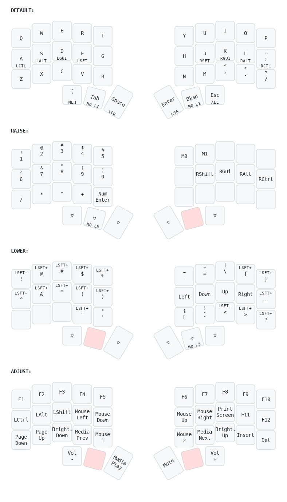

# My Keyboards Vial-QMK Layout

## Fifi MX 36 key split keyboard

### Vial to YAML Keymap

Convert your .vil files via [Vial to Keymap Drawer](https://yal-tools.github.io/vial-to-keymap-drawer)
Layout Keyboard: corned_rotated
Layout Name: LAYOUT_split_3x5_3
Layers include: 0,1,2,3

Keys out of order:
- [x] One half after another
- [x] Mirrored keys on the right
- [x] Omit `-1` keys

### Keymap Drawer
Draw your yaml layout using: [https://keymap-drawer.streamlit.app/](Keymap Drawer)

